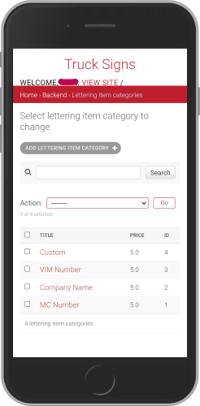

<div align="center">


# Signs for Trucks

  

</div>

A Dockerized **Django REST API** for managing truck sign products, categories, customer orders, and payments, backed by **PostgreSQL**.

The production setup uses **Nginx** as a reverse proxy/static-file server and **Gunicorn** as the WSGI application server.

> **Note:** This project is currently managed only with Docker Compose.

---

## Table of Contents

- [Overview](#overview)
- [Architecture](#architecture)
- [Project Structure](#project-structure)
- [Domain Models](#domain-models)
- [Views & API Behavior](#views--api-behavior)
- [Requirements](#requirements)
- [Quick Start](#quick-start)
  - [1. Clone the repository](#1-clone-the-repository)
  - [2. Configure environment variables](#2-configure-environment-variables)
  - [3. Build the Docker image](#3-build-the-docker-image)
  - [4. Check the logs](#4-check-the-logs)
- [Available URLs](#available-urls)
- [Configuration](#configuration)
- [Important Product Setup Note](#important-product-setup-note)
- [Screenshots](#screenshots)
- [Useful Links](#useful-links)

---

## Overview

**Signs for Trucks** is an online store for pre-designed vinyls with customizable lettering.

Customers can:

- purchase pre-designed truck vinyls;
- customize lettering directly on the website;
- upload their own designs;
- purchase simple lettering vinyls without a truck logo;
- purchase fire-extinguisher vinyls;
- purchase vinyls containing a truck unit number or another custom number.

The repository also contains the backend configuration and Docker setup required to run the Django application with PostgreSQL, Gunicorn, and Nginx.

---

## Architecture

```text
                         ┌──────────────────┐
                         │      Client      │
                         └────────┬─────────┘
                                  │
                                  ▼
                         ┌──────────────────┐
                         │      Nginx       │
                         │  Reverse Proxy   │
                         └────────┬─────────┘
                                  │
                                  ▼
                         ┌──────────────────┐
                         │ Django REST API  │
                         │     Gunicorn     │
                         └────────┬─────────┘
                                  │
                         ┌────────┴─────────┐
                         ▼                  ▼
                ┌────────────────┐  ┌────────────────┐
                │   PostgreSQL   │  │ Static / Media │
                │       DB       │  │     Volumes    │
                └────────────────┘  └────────────────┘
```

The Docker setup consists of three containers:

| Container | Image / Application | Purpose |
|---|---|---|
| `db` | `postgres:16-alpine` | PostgreSQL database |
| `django_web` | `truck_signs_api` | Django REST API |
| `nginx` | `nginx:alpine` | Reverse proxy and static/media delivery |

---

## Project Structure

Important project components include:

- `trucks_signs_api_app (tsa_app)/settings` — environment-specific Django settings.
- `Dockerfile` — builds the Django application image.
- `requirements.txt` — Python dependencies.
- `nginx.conf` — Nginx configuration mounted into the Nginx container.
- `entrypoint.sh` — prepares the Django application when the container starts.
- `.env` — runtime configuration and sensitive environment variables.
- `.gitignore` — prevents sensitive and generated files from being committed.
- `.dockerignore` — reduces the Docker build context.

---

## Domain Models

The main models are:

| Model | Purpose |
|---|---|
| **Category** | Defines a product category and shared properties for products in that category. |
| **Lettering Item Category** | Defines lettering types such as `Company Name` or `VIM NUMBER`, including their pricing. |
| **Lettering Item Variations** | Stores a lettering category together with the text entered by the customer. |
| **Product Variation** | Connects an original product with the lettering variations selected by the customer. |
| **Order** | Stores the purchased vinyl together with customer contact and shipping information. |
| **Payment** | Stores payment-related information such as purchase time and the Stripe customer ID. |

### Payments

The intended payment gateway is **Stripe**.

> **Important:** The payment implementation is currently missing because this repository is intended for documentation and testing purposes.

---

## Views & API Behavior

Most views use Django REST Framework generic class-based views from `rest_framework.generics`, such as:

- `ListAPIView`
- `CreateAPIView`
- `RetrieveAPIView`
- and related generic API views

Some workflows require custom behavior and therefore use a more flexible `GenericAPIView`.

For example:

- **Order and payment creation** are handled together in one workflow.
- **`UploadCustomerImage`** accepts a customer-uploaded vinyl template and creates a new product from it.

---

# Quick Start

## Requirements

Make sure the following are installed:

- [Docker](https://docs.docker.com/) **20.10 or higher**
- Git

---

## 1. Clone the repository

```bash
git clone git@github.com:coldicka/truck-signs-api.git
cd truck-signs-api
```

---

## 2. Configure environment variables

Copy the example environment file:

```bash
cp example.env .env
```

Then fill in the required values.

### Environment variables

| Variable | Example | Description |
|---|---|---|
| `SECRET_KEY` | `gG7Zrz4FR...` | Django secret key |
| `DB_NAME` | `trucksigns_db` | PostgreSQL database name |
| `DB_USER` | `trucksigns_user` | PostgreSQL username |
| `DB_PASSWORD` | `Your_Secure_Password!` | PostgreSQL password |
| `DB_HOST` | `db` | Database container hostname - It's best to leave the name as is. It matches the name of your service in the docker-compose.yml file. |
| `DB_PORT` | `5432` | PostgreSQL port |
| `DJANGO_SUPERUSER_USERNAME` | `admin` | Automatically created superuser username |
| `DJANGO_SUPERUSER_EMAIL` | `admin@example.com` | Automatically created superuser email |
| `DJANGO_SUPERUSER_PASSWORD` | `Your_Secure_Password!` | Automatically created superuser password |
| `ALLOWED_HOSTS` | `localhost,127.0.0.1,YOUR_IP,tsa-backend` | Allowed Hosts for the Django Application |
| `CSRF_TRUSTED_ORIGINS` | `http://localhost:8040,http://127.0.0.1:8040,YOUR_IP:8040` |  |

### Generate a secure Django secret key

```bash
python -c "import secrets; print(secrets.token_urlsafe(50))"
```

> [!CAUTION]
> **Never commit `.env` to version control.** Make sure it is listed in `.gitignore`.

---

## 3. Build the Docker image

Run this from the project root:

```bash
docker-compose build
docker-compose up -d
```

This will start all you need for this project: network, database, django, nginx

---

## 4. Check the logs

```bash
docker logs django_web
docker logs nginx
docker logs db
```

---

## Available URLs

After the containers are running:

### Django Admin

```text
http://<YOUR_IP>:8040/admin
```

---

# Configuration

The application is configured through `.env`.

The `Dockerfile` uses `python:3.12-slim` as the base image for the Django backend and installs dependencies from `requirements.txt`.

PostgreSQL is provided by the official `postgres:16-alpine` image.

Nginx uses the `nginx.conf` file from the project root, mounted into the container as a bind mount.

The `.gitignore` excludes temporary files, sensitive data, and generated content from Git. The `.dockerignore` excludes unnecessary files from the Docker build context to keep builds smaller and faster.

---

# Important Product Setup Note

> [!IMPORTANT]
> To create truck vinyls containing truck logos, first create the **`Truck Sign`** category and then create the **Product**.
>
> The frontend retrieves truck vinyls for the Product Grid based on this category.

---

# Screenshots

## Django Admin — Mobile

<div align="center">

  


</div>

## Django Admin — Desktop


---

# Useful Links

## PostgreSQL

- [DigitalOcean — Django with PostgreSQL, Nginx and Gunicorn](https://www.digitalocean.com/community/tutorials/how-to-set-up-django-with-postgres-nginx-and-gunicorn-on-ubuntu-16-04)

## Docker

- [Docker Official Documentation](https://docs.docker.com/)
- [Dockerized Django + PostgreSQL + Gunicorn + Nginx — GitHub](https://github.com/sunilale0/django-postgresql-gunicorn-nginx-dockerized/blob/master/README.md#nginx)
- [Dockerizing Django with PostgreSQL, Gunicorn and Nginx — TestDriven.io](https://testdriven.io/blog/dockerizing-django-with-postgres-gunicorn-and-nginx/)

## Django & Django REST Framework

- [Django Documentation](https://docs.djangoproject.com/en/4.0/)
- [Django REST Framework Documentation](https://www.django-rest-framework.org/)
- [Generating a Django Secret Key — Stack Overflow](https://stackoverflow.com/questions/41298963/is-there-a-function-for-generating-settings-secret-key-in-django)
- [Customizing Django Admin — Real Python](https://realpython.com/customize-django-admin-python/)
- [Customizing Django Admin Templates & CSS — Medium](https://medium.com/@brianmayrose/django-step-9-180d04a4152c)
- [Nested Serializers — Stack Overflow](https://stackoverflow.com/questions/51182823/django-rest-framework-nested-serializers)
- [DRF Generic Views — TestDriven.io](https://testdriven.io/blog/drf-views-part-2/)

## Miscellaneous

- [Virtualenv & Virtualenvwrapper — The Hitchhiker's Guide to Python](https://docs.python-guide.org/dev/virtualenvs/)
- [Django CORS Guide — StackHawk](https://www.stackhawk.com/blog/django-cors-guide/)
- [Django + Cloudinary Integration](https://cloudinary.com/documentation/django_integration)
